<script>
  MathJax = {
    tex: {
      inlineMath: [['$', '$']]
    }
  };
</script>
<script type="text/javascript" id="MathJax-script" async
  src="https://cdn.jsdelivr.net/npm/mathjax@3/es5/tex-mml-chtml.js">
</script>

# Deep Metric Learning

## Introduction
An HD (1920x1080) image has 2073600 pixels. If we completely ignore colour and assume each pixel is grayscale that image will still have a dimensionality of 2 million. I have a hard time imagining 3D things in my head, let alone 4D or even 2 million dimensions. This is where deep metric learning can be of use to us.

Deep metric learning is a deep learning method that tries to learn how to best reduce the dimensionality of inputs, from for example 10D down to a much more manageble (and visible) 3D, 2D, or 1D. In this post I will be exploring some of the first algorithms and tehcniques used to implement deep metric learning, and will be applying them to the MNIST handwritten digit dataset.  Each image in the MNIST digit dataset is a grayscale 28x28 pixel image, which means that each image has 784 dimensions. Through deep metric learning I'll be attempting to reduce this to a 2D space.

Throughout each section I'll show the code used to implement each part needed to perform deep metric learning, which will hopefully serve as start off point for anyone interested in implementing this themselves. Everything is written in Python using PyTorch.

First I will cover the basic idea and notation, then I will cover 2 deep metric learning techniques called contrastive learning and triplet learning. Finally I'll show some results and ideas for future work.

## Basics
The basic idea behind deep metric learning is to reduce the dimensionality of an input in such a way that similar samples will be close together in the output space. If we have neural network $G_W(x)$, where $W$ are the parameters, then the goal for two items of the same class is for the distance

$$
d(G_W(x_1), d_W(x_2))
$$

to be small. For two items of dissimilar items we instead want this distance to be large. For this project I'll be using the euclidean distance

$$
\sum_{i=1}^n (x_i - y_i)^2
$$

```python
class EuclideanDistance(nn.Module):
    def __init__(self) -> None:
        super().__init__()

    def forward(self, x: torch.Tensor, y: torch.Tensor) -> torch.Tensor:
        # sqrt( sum_i (x_i - y_i)^2)
        return (x - y).square().sum(dim=-1).sqrt()
```

## Contrastive Learning

I'll be following along with [1] for my implementation of contrastive learning.

Contrastive learning works on the premise that points that are similar should be placed close together in the output manifold, and points that are different should be placed far apart. It does this by comparing (contrasting) two points against each other, and calculating the loss.

### Contrastive Loss
The contrastive loss consists of two parts, a similar and a dissimilar part. The similar part increases when two samples that have the same class are far away from each other.

$$
d(G_W(x_1), G_W(x_2))^2
$$

The dissimilar part increases when two samples with different classes are closer to each other than some margin $m$. This part is needed because with only the similar loss the output of the network would collapse by embedding all inputs to the same point.

$$
max(0, m - d(G_W(x_1), G_W(x_2)))^2
$$

Combining both losses we get

$$
L(W, Y) = \frac{1}{2} (Y) (D_W)^2 + \frac{1}{2} (Y - 1) \max(0, m - D_W)^2
$$

Where $D_W$ is the distance, and $Y$ is a vector which is 1 for similar pairs, and 0 for dissimilar pairs.

```python
class ContrastiveLoss(nn.Module):
    """
    Contrastive Loss as described in
    Dimensionality Reduction by Learning an Invariant Mapping
    http://yann.lecun.com/exdb/publis/pdf/hadsell-chopra-lecun-06.pdf
    """
    def __init__(self, distance: nn.Module, margin: float = 1.0, positive_weight: float = 0.5) -> None:
        super().__init__()
        self.distance = distance
        self.margin = margin
        self.positive_weight = positive_weight

    def forward(self, x: torch.Tensor, y: torch.Tensor, x_labels: torch.Tensor, y_labels: torch.Tensor) -> torch.Tensor:
        # compare x labels to y labels to get simmilar and dissimilar pairs
        equal: torch.Tensor = x_labels == y_labels
        # calculate distances between all pairs
        distances: torch.Tensor = self.distance(x, y)

        # Calculate the positive loss d^2
        positive_loss = equal * self.positive_weight * (distances).square()
        # Calculate the negative loss max(0, m - d)^2
        negative_loss = (~equal) * (1 - self.positive_weight) * \
            (self.margin - distances).clamp(0).square()

        return (positive_loss + negative_loss).sum()
```


### Contrastive Miner

In most implementations of deep metric learning something called a miner is used to find suitable groups of data to learn from. In the case of contrastive learning we would want a miner that finds pairs of data (both similar and dissimilar) that contain a high amount of information, so similar pairs that are far apart or dissimilar pairs that are close together. To keep things simpel I decided to skip the complicated miner part, and instead made a miner that takes in the current batch as input and pairs data based on their index.

This "miner" transforms a list into two lists of equal length, where now each index $i$ corresponds to a sample in the left and right list, so each index $i$ now forms a pair.

```python
class ContrastiveMiner(nn.Module):
    def __init__(self, dimensionality: int = 2) -> None:
        super().__init__()
        self.dimensionality = dimensionality

    def forward(self, embeddings: torch.Tensor, labels: torch.Tensor) -> Tuple[torch.Tensor, torch.Tensor]:
        # Transform data from
        # 0 1 2 3 4 5 6 7 8 9 to [0, 1, 2, 3, 4], [5, 6, 7, 8, 9]
        # to create pairs of data
        embeddings = embeddings.reshape(2, embeddings.shape[0] // 2, self.dimensionality)
        labels = labels.reshape(2, labels.shape[0] // 2)
        return embeddings, labels
```

## Triplet Learning

I'll be following along with [2] for my implementation of contrastive learning.

Triplet learning is an improvement on contrastive learning. Instead of comparing two samples to each other, forming a similar or dissimilar pair, triplet learning will compare one point (called the anchor) to two other points, a negative and a positive. By doing this each training iteration will contain information about both the similar and dissimilar pair.

### Triplet Loss

Triplet loss again consists of two parts, a negative and a positive part. This time however both parts of the loss are calculated for each sample in the batch, this is because each sample is a triplet consisting of (anchor, positive, negative) = $(x_i^a, x_i^p, x_i^n)$.

$$
\sum_{i=1}^n[d(G_W(x_i^a), G_W(x_i^p)) - d(G_W(x_i^a), G_W(x_i^n)) + m]_+
$$

Here we again use the margin $m$ to avoid the network output collapsing onto a single point.

```python
class TripletLoss(nn.Module):
    """
    Triplet Loss as described in
    FaceNet: A Unified Embedding for Face Recognition and Clustering
    https://arxiv.org/abs/1503.03832
    """
    def __init__(self, distance: nn.Module, margin: float = 1.0) -> None:
        super().__init__()
        self.distance = distance
        self.margin = margin

    def forward(self, anchors: torch.Tensor, positives: torch.Tensor, negatives: torch.Tensor) -> torch.Tensor:
        # calculate distances of anchor positive pairs
        positive_distances = self.distance(anchors, positives).square()
        # calculate distances of anchor negative pairs
        negative_distances = self.distance(anchors, negatives).square()
        # loss = (d_pos - d_neg + margin)
        return (positive_distances - negative_distances + self.margin).clamp(0).sum()
```

### Triplet Miner

Just like contrastive learning you need a miner for triplet learning as well. Once again I implemented a very simple version of a miner. This one just iterates over all samples and if it find a anchor, positive, and negative, it adds it to the list. I would highly recommend reading [2] for more information about their miner.

```python
class TripletMiner(nn.Module):
    def __init__(self) -> None:
        super().__init__()

    def forward(self, embeddings: torch.Tensor, labels: torch.Tensor) -> Tuple[torch.Tensor, torch.Tensor]:
        i = 0
        anchors = []
        positives = []
        negatives = []
        while i < len(labels):
            positive = None
            negative = None

            j = i + 1
            while j < len(labels):
                if labels[j] == labels[i] and positive is None:
                    positive = j
                if labels[j] != labels[i] and negative is None:
                    negative = j
                if positive is not None and negative is not None:
                    anchors.append(embeddings[i])
                    positives.append(embeddings[positive])
                    negatives.append(embeddings[negative])
                    break
                j = j + 1
            i = i + 1

        triplets = torch.stack([
            torch.stack(anchors),
            torch.stack(positives),
            torch.stack(negatives),
        ])
        return triplets, None
```

## Network

For the network I followed the example given in [1]. This is a very basic convolutional layer consisting of
- A convolutional layer with kernel size 6 and 15 out channels
- A pooling layer with kernel size 3
- A second convolutional layer with kernel size 9 and 30 out channels
- A fully connected layer which reduces the output from the previous layer to the output dimensionality
The activation function, which is applied to every layer but hte last, is the relu function.

```python
class LecunConvolutionalNetwork(nn.Module):
    """
    Convolutional Network as described in
    Dimensionality Reduction by Learning an Invariant Mapping
    http://yann.lecun.com/exdb/publis/pdf/hadsell-chopra-lecun-06.pdf
    """
    def __init__(self, dimensionality: int = 2) -> None:
        super().__init__()
        self.conv1 = nn.Conv2d(1, 15, 6)
        self.pool1 = nn.AvgPool2d(3)
        self.conv2 = nn.Conv2d(15, 30, 9)
        self.fc1 = nn.Linear(30, dimensionality)

    def forward(self, x: torch.Tensor) -> torch.Tensor:
        x = F.relu(self.conv1(x))
        x = self.pool1(x)
        x = F.relu(self.conv2(x))
        x = x.reshape(x.shape[0], -1)
        x = self.fc1(x)
        return x
```

## Results
I ran several experiments, each with different subsections of the data, to see how both algorithms perform. The code used to run all these tests can be found in the Appendix at the bottom of the page. All outputs are normalized to be between 0 and 1.

All results are shown as a gif to show the learning progression over time, for static images of the final result check out the appendix.

*Contrastive Learning 1 5 9*

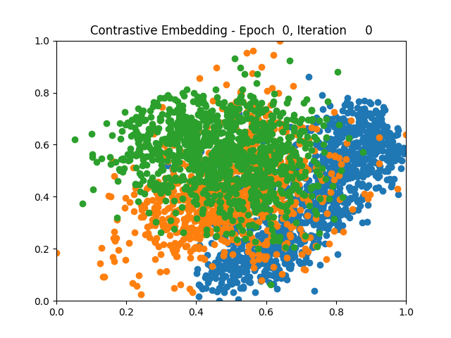


*Triplet Learning 1 5 9*

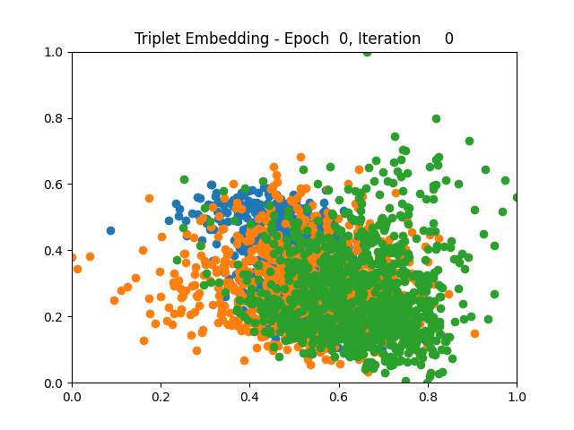


*Contrastive Learning 1 2 5 6 8 9*

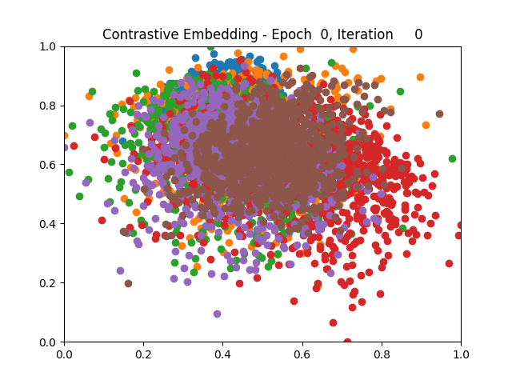


*Triplet Learning 1 2 5 6 8 9*

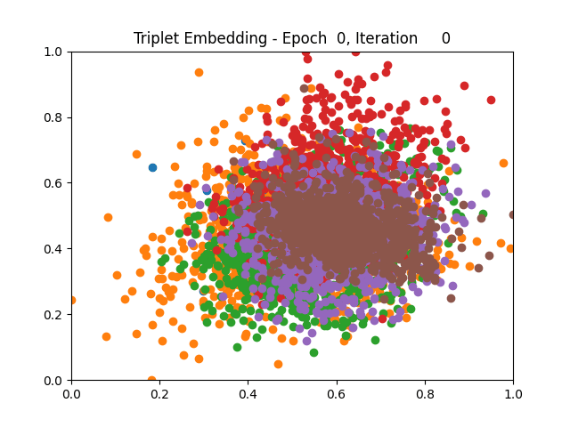


*Contrastive Learning all*


*Triplet Learning all*

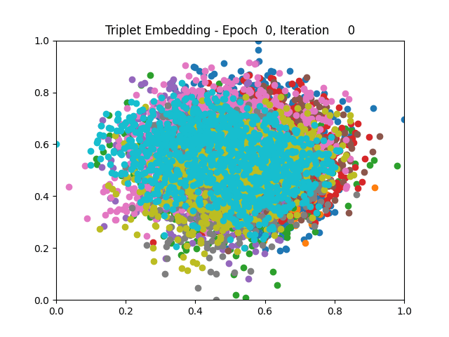

I tested both contrastive learning on different sets of labels. These sets were $[1, 5, 9]$, $[1, 2, 5, 6, 8, 9]$, and all labels ($[0, 1, 2, 3, 4, 5, 6, 7, 8, 9]$).

## Conclusion

Both methods performed decently well, especially on the datasets with fewer labels. In earlier tests I saw triplet learning perform better than contrastive learning, but in these tests triplet learning did not perform any better than contrastive, and in the case of the labels $[1, 5, 9]$ it seems to perform quite a bit worse.

Overall both methods do show some clear clustering, and when there's fewer labels the distance between the clusters is quite good as well. Perhaps setting a larger margin with more labels could help?

## Future Work
Due to time constraints I was not able to implement everything (in as much detail) as I originally wanted. This section will list possible improvements to this project.

**Miners:** Both miners are quite simple, perhaps by improving them the network can learn from more informative samples and thus get better results.

**Other Methods:** The two deep metric learning methods discussed here are far from the only ones. It could be interesting to implement other methods and compare their results.

**GPU Speedup:** Currently there is an implementation of GPU acceleration, but it is not very good. To create the images data needs to be moved from the GPU to CPU, doing this every batch slows the whole process down quite a lot. 

```python
def test(network: nn.Module, testloader: DataLoader, dimensionality: int) -> Tuple[torch.Tensor, torch.Tensor]:
    with torch.no_grad():
        all_results = torch.zeros(0, dimensionality)
        all_labels = torch.zeros(0)
        for (inputs, labels) in testloader:
            inputs, labels = inputs.to(get_device()), labels.to(get_device())
            outputs = network(inputs)

            all_results = torch.cat((all_results, outputs.detach().cpu()))
            all_labels = torch.cat((all_labels, labels.detach().cpu()))
    max_result, _ = torch.max(all_results, dim=0)
    min_result, _ = torch.min(all_results, dim=0)
    return (all_results - min_result) / (max_result - min_result), all_labels
```

I think leaving the entire results and labels tensor in GPU memory untill the iteration is done should work because each item in the tensor is only 2 values, but I currently do not have access to a GPU to test this.

## Citations
1. R. Hadsell, S. Chopra, and Y. LeCun. Dimensionality reduction by learning an invariant map-
ping. In 2006 IEEE Computer Society Conference on Computer Vision and Pattern Recognition
(CVPR’06), volume 2, pages 1735–1742, 2006.
2. Florian Schroff, Dmitry Kalenichenko, and James Philbin. Facenet: A unified embedding for face
recognition and clustering. CoRR, abs/1503.03832, 2015.

## Appendix
## Static Results
*Contrastive Learning 1 5 9*

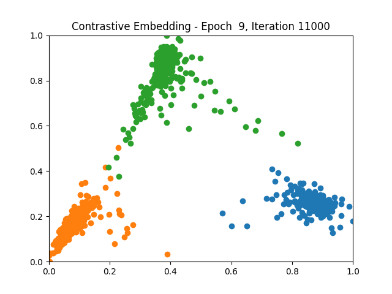


*Triplet Learning 1 5 9*

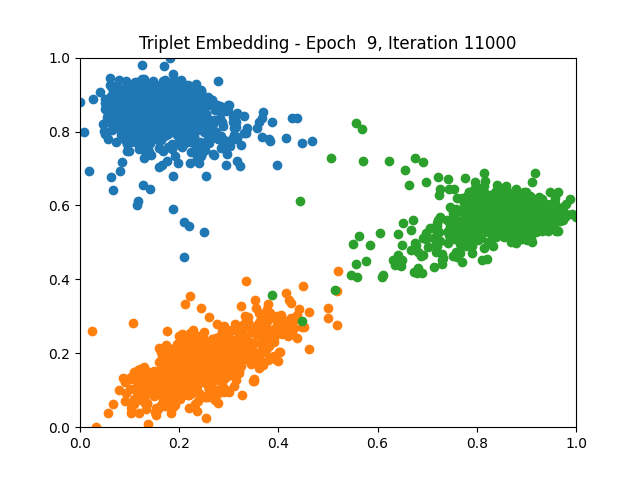


*Contrastive Learning 1 2 5 6 8 9*

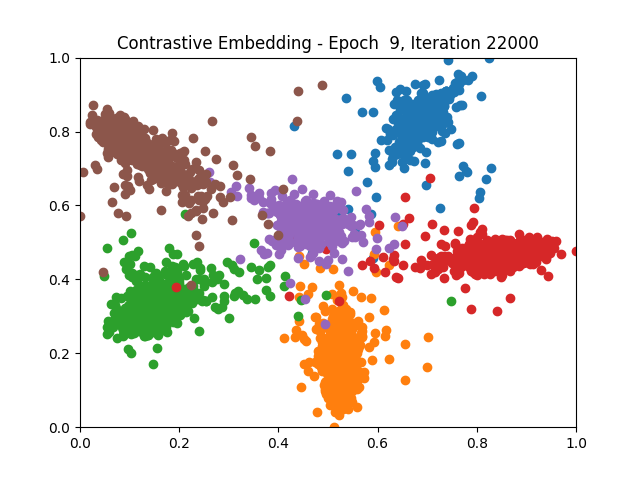


*Triplet Learning 1 2 5 6 8 9*

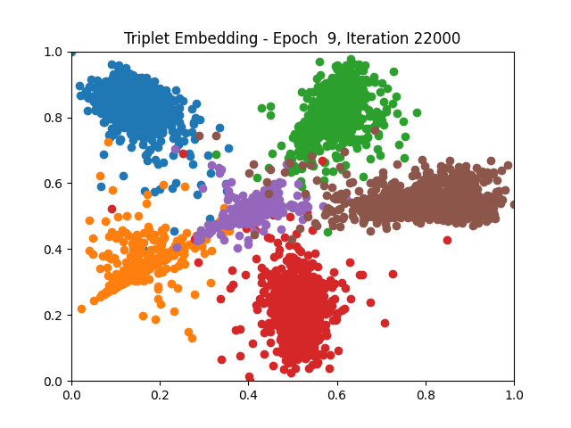


*Contrastive Learning all*

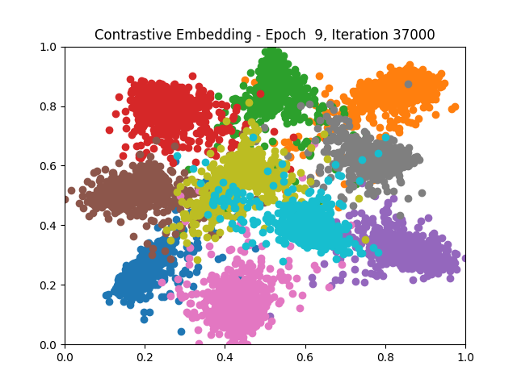


*Triplet Learning all*

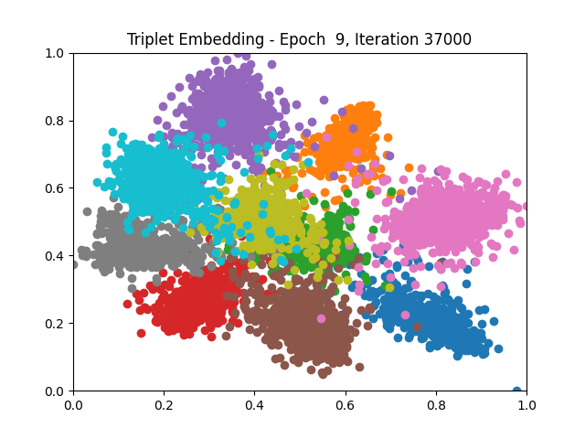
### Main File
```python
import torch
import torchvision
import torchvision.transforms as transforms
import torch.nn as nn
import torch.optim as optim
from torch.utils.data import DataLoader, Dataset
import argparse
import matplotlib.pyplot as plt
from typing import Tuple
import imageio
import uuid
import os

from distances import EuclideanDistance
from losses import ContrastiveLoss, TripletLoss
from miners import ContrastiveMiner, TripletMiner
from networks import LecunConvolutionalNetwork


def get_device() -> torch.device:
    return torch.device('cuda:0' if torch.cuda.is_available() else 'cpu')


def handle_arguments():
    parser = argparse.ArgumentParser()
    parser.add_argument('--results_root', type=str, default='results',
                        help='Name of the directory to store experiments in')
    parser.add_argument('--experiment_name', type=str, default=None,
                        help='Name of the current experiment. Used to store results')
    parser.add_argument('--mode', type=str, default='contrastive',
                        help='Mode to use. contrastive (default) or triplet')
    parser.add_argument('--labels', type=int, nargs='+',
                        default=[0, 1, 2, 3, 4, 5, 6, 7, 8, 9], help='Labels to use for the experiment')
    parser.add_argument('--dimensionality', type=int, default=2,
                        help='Manifold dimensionality to map the data to')
    parser.add_argument('--epochs', type=int, default=100,
                        help='Number of training epochs')
    parser.add_argument('--test_every', type=int, default=100,
                        help='Number of training epochs')
    parser.add_argument('--repeat_frames', type=int, default=3,
                        help='Repeat a frame a number of times to slow down the GIF')
    parser.add_argument('--repeat_last_frame', type=int, default=30,
                        help='Repeat the last frame a number of times to pause the GIF here')
    parser.add_argument('--batch_size', type=int,
                        default=16, help='Dataloader batch size')
    parser.add_argument('--num_workers', type=int, default=0,
                        help='Dataloader number of workers')

    args = parser.parse_args()

    if args.experiment_name == None:
        args.experiment_name = uuid.uuid4()

    return args


def load_data(args):
    transform = transforms.Compose([transforms.ToTensor(), transforms.Pad(2)])

    trainset = torchvision.datasets.MNIST(root='./data', train=True,
                                          download=True, transform=transform)
    trainset = select_samples(trainset, args.labels)
    trainloader = DataLoader(trainset, batch_size=args.batch_size,
                             shuffle=True, num_workers=args.num_workers)

    testset = torchvision.datasets.MNIST(root='./data', train=False,
                                         download=True, transform=transform)
    testset = select_samples(testset, args.labels)
    testloader = DataLoader(testset, batch_size=args.batch_size,
                            shuffle=False, num_workers=args.num_workers)

    return trainloader, testloader


def create_directores(results_root: str, experiment_name: str):
    if not os.path.isdir(f'./{results_root}'):
        os.mkdir(f'./{results_root}')
    if not os.path.isdir(f'./{results_root}/{experiment_name}'):
        os.mkdir(f'./{results_root}/{experiment_name}')


def select_samples(dataset: torch.Tensor, labels: torch.Tensor) -> Dataset:
    """
    Select a subset of all data
    """
    idx = torch.zeros_like(dataset.targets)
    for label in labels:
        idx = torch.logical_or(dataset.targets == label, idx)
    dataset.targets = dataset.targets[idx]
    dataset.data = dataset.data[idx]
    return dataset


def main() -> None:
    device = get_device()
    args = handle_arguments()
    print(f'Starting Experiment [{args.experiment_name}]')
    create_directores(args.results_root, args.experiment_name)
    results_directory = f'{args.results_root}/{args.experiment_name}'

    trainloader, testloader = load_data(args)

    # Setup miner and criterion
    if args.mode == 'contrastive':
        miner = ContrastiveMiner(dimensionality=args.dimensionality)
        criterion = ContrastiveLoss(distance=EuclideanDistance())
    elif args.mode == 'triplet':
        miner = TripletMiner()
        criterion = TripletLoss(distance=EuclideanDistance())
    # Setup network and optimizer
    network = LecunConvolutionalNetwork(
        dimensionality=args.dimensionality).to(device)
    optimizer = optim.Adam(network.parameters())

    iteration = 0
    image_paths = []
    for epoch in range(args.epochs):
        print(f'Epoch [{epoch:2}]')
        for (inputs, labels) in trainloader:
            # Ensures batch can always be split in 2
            if args.mode == 'contrastive' and len(inputs) % 2 != 0:
                inputs = inputs[:-1]
                labels = labels[:-1]
            inputs, labels = inputs.to(device), labels.to(device)
            # Create an image of the current test embedding
            if iteration % args.test_every == 0:
                print(f'Iteration [{iteration:5}]')
                image_path = f'./{results_directory}/{epoch}_{iteration}.png'
                test_results, test_labels = test(
                    network, testloader, args.dimensionality)
                scatter(test_results, test_labels, image_path,
                        f'{args.mode.capitalize()} Embedding - Epoch {epoch:2}, Iteration {iteration:5}')
                image_paths.append(image_path)
            # Optimize network
            optimizer.zero_grad()
            outputs = network(inputs)
            outputs, labels = miner(outputs, labels)

            if args.mode == 'contrastive':
                loss = criterion(outputs[0], outputs[1], labels[0], labels[1])
            elif args.mode == 'triplet':
                loss = criterion(outputs[0], outputs[1], outputs[2])

            loss.backward()
            optimizer.step()

            iteration += 1
    # Create gif of all the test images
    create_gif(image_paths, results_directory,
               args.repeat_frames, args.repeat_last_frame)


def test(network: nn.Module, testloader: DataLoader, dimensionality: int) -> Tuple[torch.Tensor, torch.Tensor]:
    with torch.no_grad():
        all_results = torch.zeros(0, dimensionality)
        all_labels = torch.zeros(0)
        for (inputs, labels) in testloader:
            inputs, labels = inputs.to(get_device()), labels.to(get_device())
            outputs = network(inputs)

            all_results = torch.cat((all_results, outputs.detach().cpu()))
            all_labels = torch.cat((all_labels, labels.detach().cpu()))
    max_result, _ = torch.max(all_results, dim=0)
    min_result, _ = torch.min(all_results, dim=0)
    return (all_results - min_result) / (max_result - min_result), all_labels


def scatter(results: torch.Tensor, labels: torch.Tensor, image_path: str, title: str) -> None:
    for label in torch.unique(labels):
        idx = labels == label
        embeddings = results[idx].transpose(0, 1)
        # Set x and y lim so result gif doesn't bounce around
        plt.xlim(0, 1)
        plt.ylim(0, 1)
        plt.title(title)
        plt.scatter(embeddings[0], embeddings[1], label=label.item())
    plt.savefig(image_path)
    plt.clf()


def create_gif(image_names: list[str], results_directory: str, repeat_frames: int, repeat_last_frame: int) -> None:
    images = []
    for filename in image_names[:-1]:
        images.extend([imageio.imread(filename)] * repeat_frames)
    images.extend([imageio.imread(image_names[-1])] * repeat_last_frame)
    imageio.mimsave(f'./{results_directory}/movie.gif', images)


if __name__ == '__main__':
    main()
```